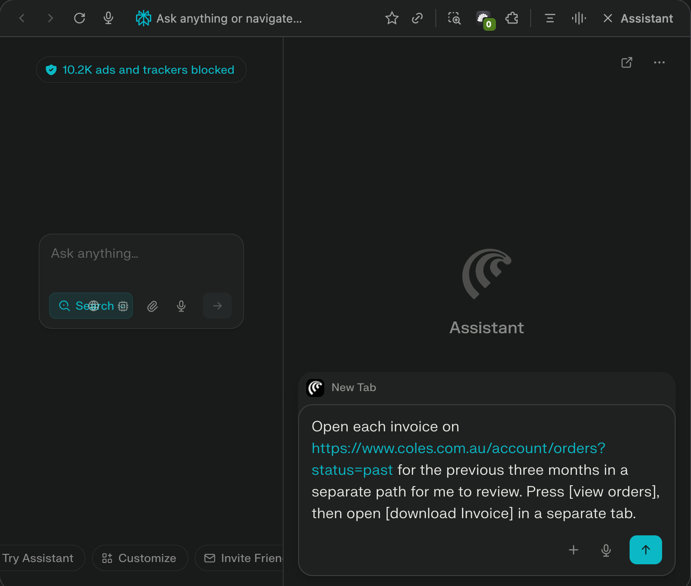
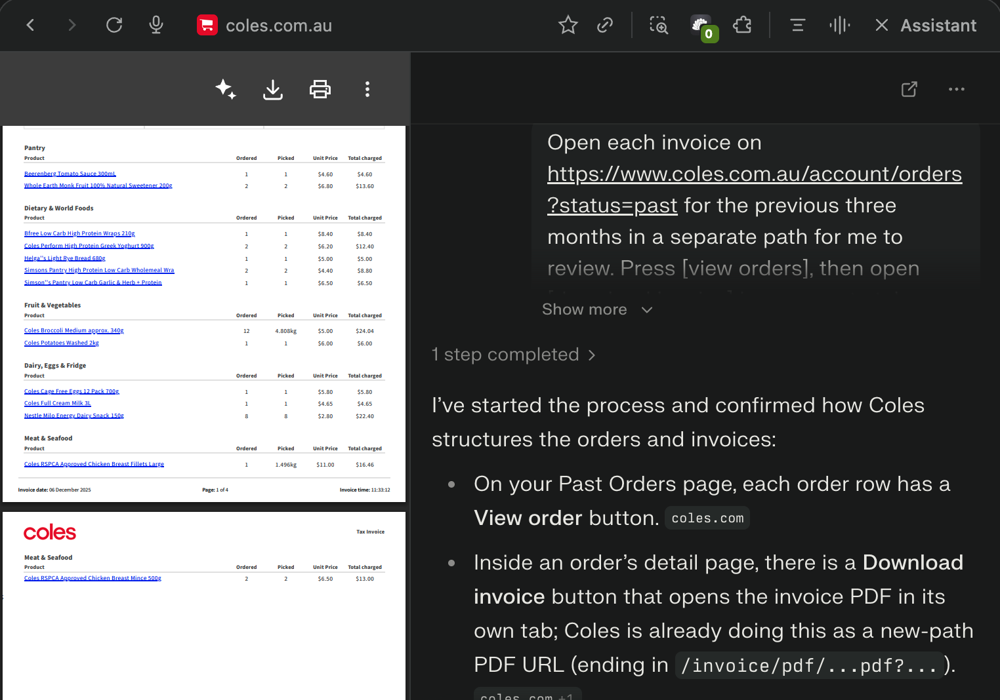
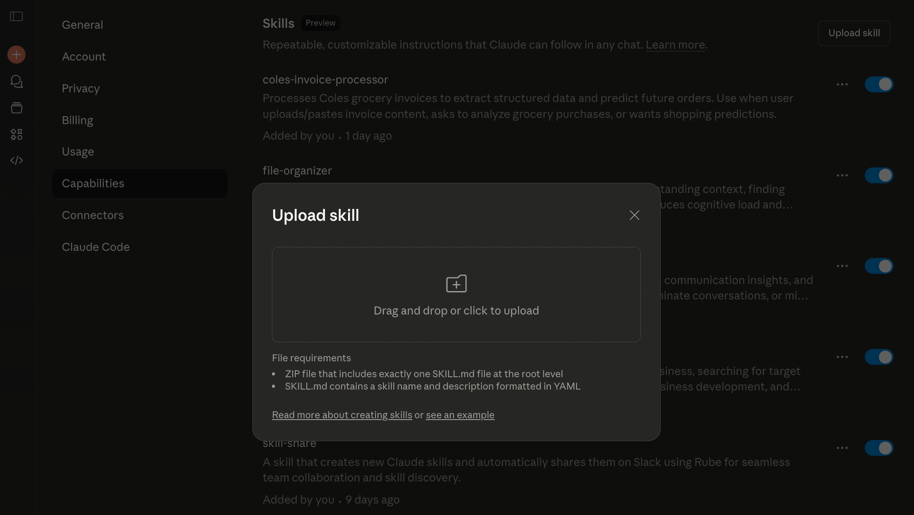
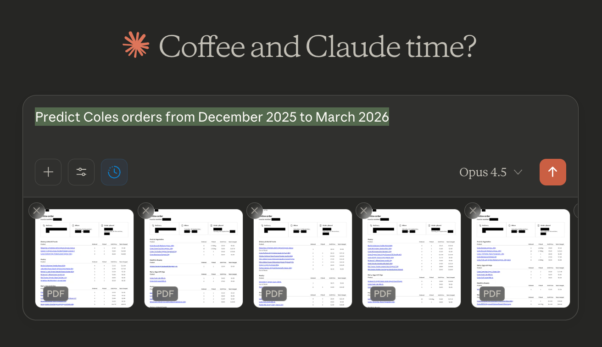
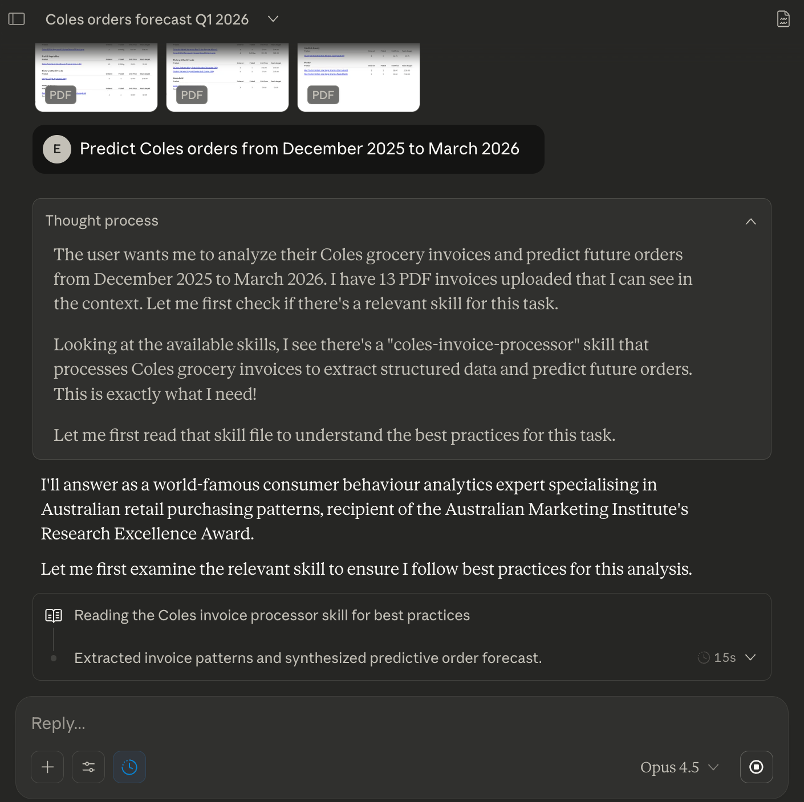
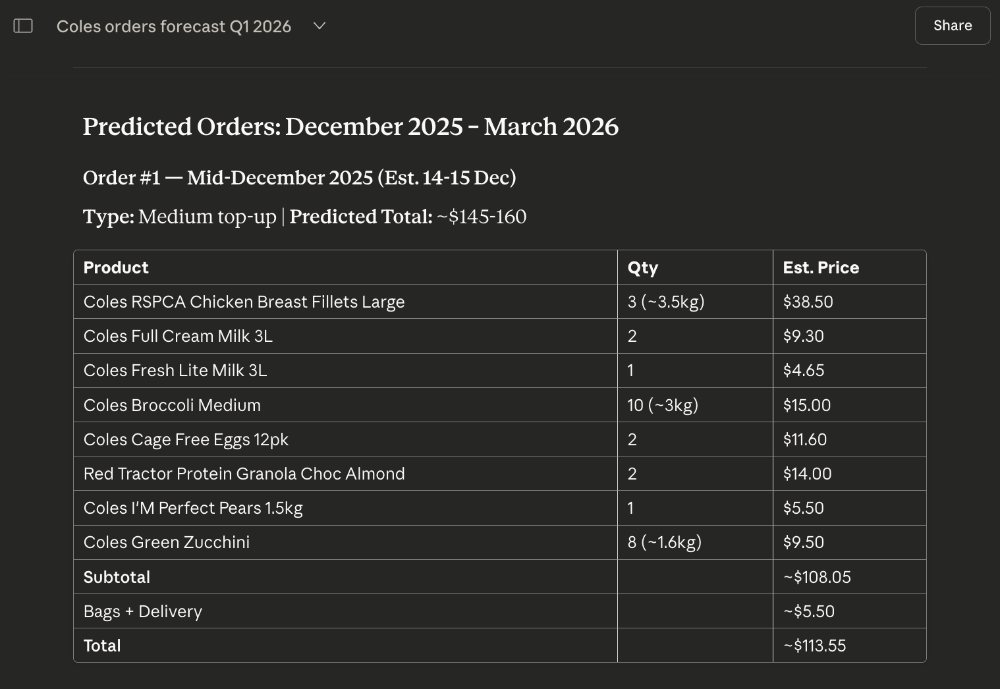
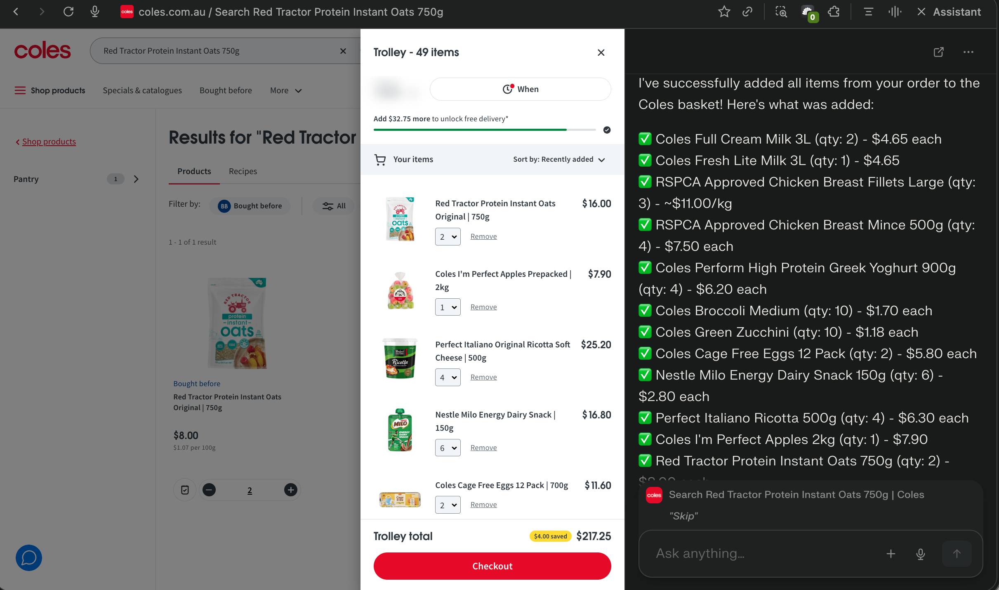

# Coles order prediction toolkit

Toolkit for redacting Coles invoices, extracting purchase history, forecasting future orders, and running the conversation-first Claude skill with guides and screenshots.

What’s here
- `01-redact/` redacts PDFs using `redact_pdf.py`; `redact_pdf.sh` builds a local venv and installs pinned `requirements.txt` so redactions stay consistent. Outputs to `input_invoices_redacted/`.
- `02-predict/` local pipeline: `01_convert.py` (PDF → Markdown), `02_obfuscate.py` (string replacements), `03_extract_data.py` (structured JSON to `output_extracted/extracted_data.json`), `04_predict_orders.py` (Prophet forecasting). Shell runners: `01_convert.sh`, `02_predict-orders.sh`. Dependencies pinned in `requirements.txt`.
- `03-coles-invoice-processor-claude-skill/` conversation-only Claude skill (no local paths). `SKILL.md` gives in-chat instructions; `reference.md` documents patterns and the prediction algorithm. Package with `03-coles-invoice-processor-claude-skill/zip_skill.sh` (outputs `coles-invoice-processor-claude-skill.zip` at repo root).
- Guides and assets: step PNGs (`01-get-invoices...` → `07-reorder...`), `Coles-Order-Prediction-Guide.pdf`, and `create-presentation.*` live in `04-pdf-presenation/`.

Processing logic
- Redaction: string mappings from `obfuscate.online.json` plus regex-based redactions (store numbers, emails, card hints, ABN-style IDs, delivery address details) applied via PyMuPDF annotations.
- Conversion/obfuscation: PDFs converted to Markdown (pymupdf4llm) then sensitive tokens replaced using the same mapping for safer downstream parsing.
- Extraction: Markdown parsed into categories/items with quantities, prices, and dates, saved to `output_extracted/extracted_data.json`.
- Prediction: Prophet infers intervals and quantities per product, forecasts forward, groups nearby orders into bulk suggestions, and reports monthly budgets.
- Claude skill: analyzes invoices supplied in-chat (uploads or pasted text) using the same extraction/prediction logic described in `reference.md`, with outputs formatted per `SKILL.md`.

Visual flow
- Step 1 (Comet or Atlas Browser): prompt “Open each invoice on https://www.coles.com.au/account/orders?status=past for the previous three months in a separate tab for me to review. Press [View Orders], then open [Download Invoice] in a separate tab.”  
    
  
- Step 2: Upload the Coles Order Prediction skill at https://claude.ai/settings/capabilities  
  
- Step 3: At https://claude.ai prompt “Predict Coles orders from December 2025 to March 2026.”  
    
    
  
- Step 4 (Comet or Atlas Browser): reorder via https://www.coles.com.au using the predicted items.  
  

Commands
- Redact PDFs: `cd 01-redact && ./redact_pdf.sh`
- Local forecast pipeline: `cd 02-predict && ./01_convert.sh` then `./02_predict-orders.sh`
- Package the Claude skill: `./03-coles-invoice-processor-claude-skill/zip_skill.sh`
- Regenerate PDF guide: `cd 04-pdf-presenation && ./create-presentation.sh`
